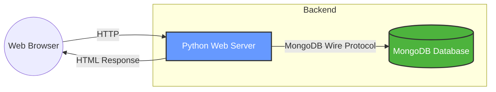

# The Visitor Counter
CSC 468: Intro to Cloud Computing Term: Spring 2026

## 1. Vision
The goal of this project is to build a web application that tracks and displays the total number of visits that the website has encountered. The architecture separates the application logic from the persistent data state.

### Communication Protocol
- Client to App: The user interacts with the system via standard HTTP/REST requests.

- App to Database: The Python application communicates with MongoDB over TCP on port 27017 using the MongoDB Wire Protocol (via the PyMongo driver).

## 2. Proposal
This project will be containerized and designed for deployment on CloudLab. The following base images have been selected for their efficiency and reliability:

Component: Web Server
- Base Image: python:3.11-slim

- The component provides a Debian-based environment for it's variant being "slim" which reduces the image size significanlty compared to the standard python image. From this, the benefits for using the image is speeding up deployment across the nodes inside the cloud.

Component: Database 
- Base Image: mongo:latest

- The official Image for MongoDB. Mainly use schema-less data storage, which is mainly ideal for rapid development and scaling within cloud environments. 

## Project Structure
Folder Structure:
- app/: Contains the python source code and Dockerfile for the web server
- docs/: Has the proejct documentation and the resume
- README.md: The project's vision, proposal, and architect overview

## Resume
- Located inside the "docs/" folder named "resume.pdf"
