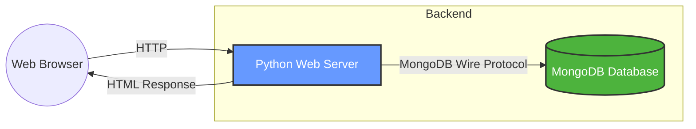

# The Visitor Counter
CSC 468: Intro to Cloud Computing Term: Spring 2026

## 1. Vision
The goal of this project is to build a web application that tracks and displays the total number of visits that the website has encountered. The architecture separates the application logic from the persistent data state.

```mermaid
graph LR
    User((Web Browser)) -- HTTP --> App
    
    subgraph Backend
        App[Python Web Server] -- MongoDB Wire Protocol --> DB[(MongoDB Database)]
    end
    
    App -- HTML Response --> User

    style DB fill:#4DB33D,stroke:#333,stroke-width:2px,color:#fff
    style App fill:#69f,stroke:#333,stroke-width:2px,color:#fff
```

### Communication Protocol
- Client to App: The user interacts with the system via standard HTTP/REST requests.

- App to Database: The Python application communicates with MongoDB, using the MongoDB Wire Protocol (via the PyMongo driver).

## 2. Proposal
This project will be containerized and designed for deployment on CloudLab. The following base images have been selected for their efficiency and reliability:

Component: Web Server
- Base Image: python:3.11-slim

- The component provides a Debian-based environment for it's "slim" variant which reduces the image size significantly compared to the standard python image. From this, the benefits for using the image is speeding up deployment across the nodes inside the cloud.

Component: Database 
- Base Image: mongo:latest

- The official Image for MongoDB. Mainly use schema-less data storage, which is mainly ideal for rapid development and scaling within cloud environments. 

## 3. Build Process
- Base Image Choice: `python:3.11-slim`

python:3.11-slim is a pre-built and stripped down version of the Debian Linux OS compared to python:3.11 image. The slim variant is smaller than it's counterpart (50MB vs 900MB) in which reduces the pull times and storage costs when deploying across the CloudLab nodes. Python 3.11 was chosen for it's performance improvements over earlier versions.

- `WORKDIR /app`
Sets "/app" as the main working directory within the container. All other components in the Dockerfile operates relative to this path. In order to keep the container's filestystem neat and clean.

- `RUN pip install --no-cache-dir pymongo flask`
Installs two Python dependencies which is Flask, for lightweight web framework for HTTP responses and PyMongo, used to connect with the database container.

- `Copy main.py .`
Copies the contents of the application source file into the container's /app directory. Only main.py is copied rather than the entire project directory.

- `EXPOSE 5000`
Documents the container listens on port 5000 at runtime.

- `CMD ["python","main.py"]`
  Defines the defualt command executed when the container starts.

## Database
The MongoDB container uses the official mongo:latest image directly. The official image comes pre-configured with the MongoDB daemon and exposes port 27017 by default.
